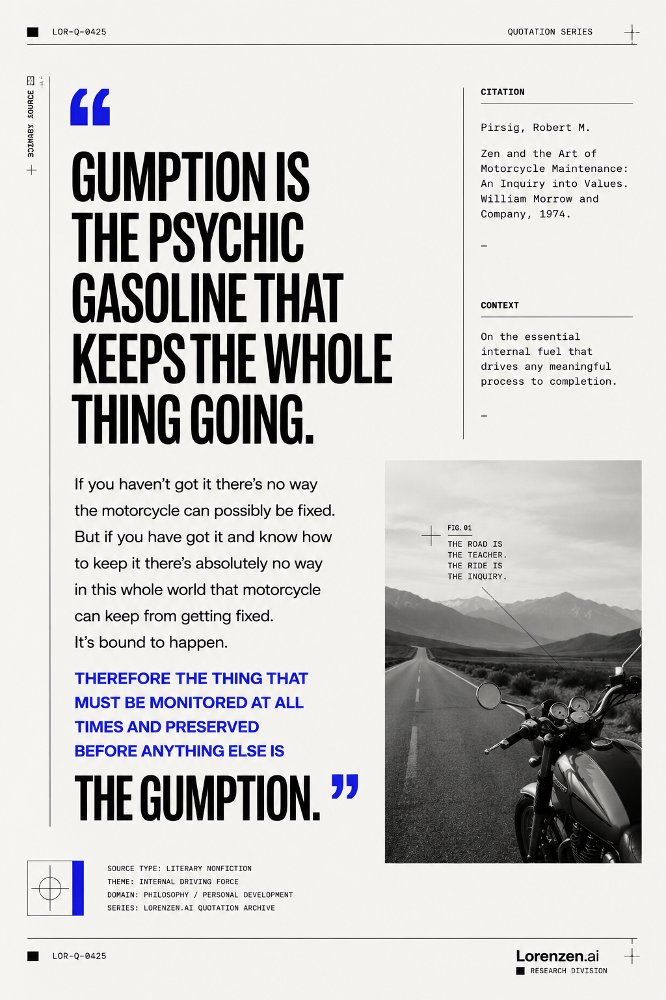
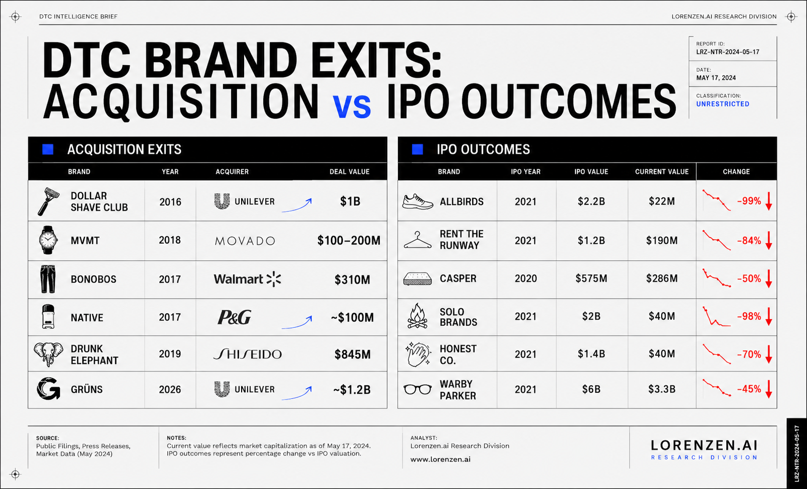
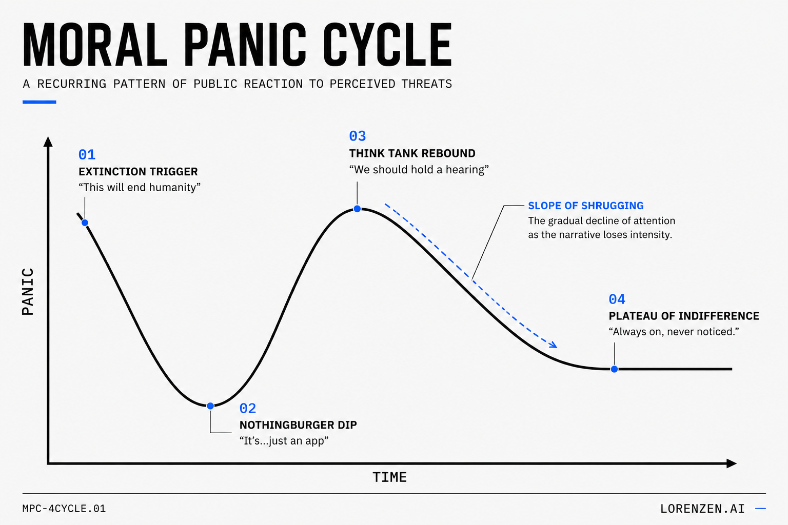
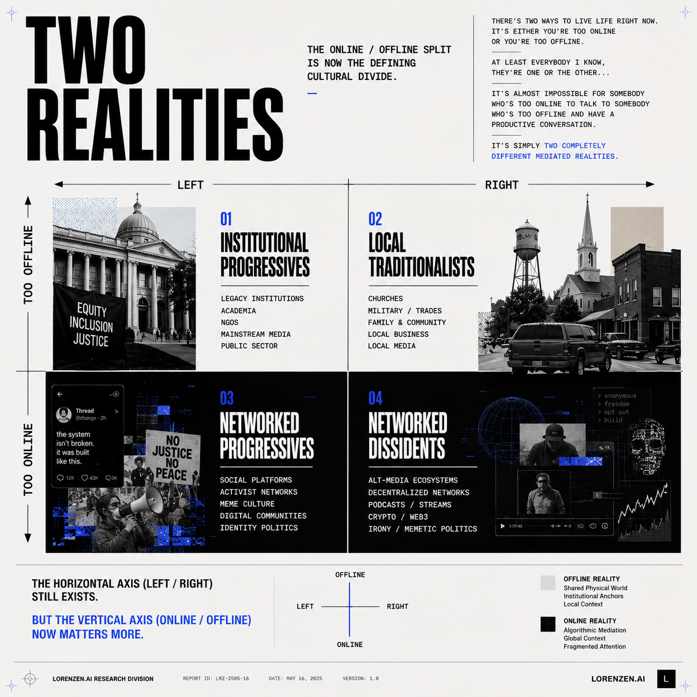

# Gallery

A collection of visual essays, diagrams, cultural observations, and marketing artifacts.

These pieces explore advertising, technology, cognition, internet culture, media systems, and modern mythology.

---

# Brain vs AI

A comparison between biological intelligence and machine computation.

---

# Gumption

A visual interpretation of Robert Pirsig’s concept of “gumption.”

---

# Clipping Economy

A diagram about the emerging clipping economy.

---

# DTC Exit

A commentary on modern direct-to-consumer business cycles.

---

# Mindset

A stripped-down philosophical graphic about self-narrative.

---

# Moral Panic

A visual essay about recurring cycles of technological panic.

---

# Two Realities

A framework mapping the divide between online and offline realities.

---

# Waveform

An abstract visual about signal propagation and information systems.

---

# Clipping Deck

[View PDF](images/gallery/Clipping%20Deck.pdf)

A presentation deck exploring clipping and amplification systems.
