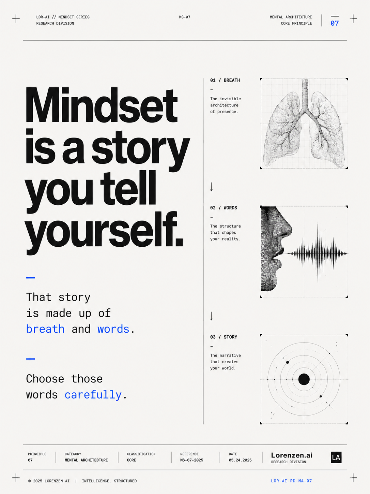
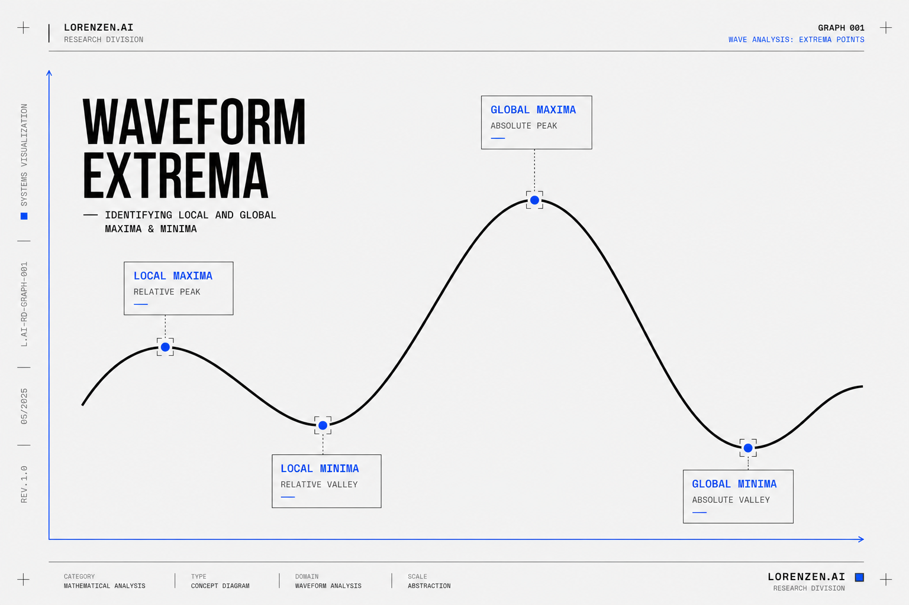

# Gallery

A collection of visual essays, diagrams, cultural observations, and marketing artifacts.

These pieces explore advertising, technology, cognition, internet culture, media systems, and modern mythology.

---

# Brain vs AI

  

A comparison between biological intelligence and machine computation.

---

# Gumption

  

A visual interpretation of Robert Pirsig’s concept of “gumption” from *Zen and the Art of Motorcycle Maintenance*.

---

# Clipping Economy

  

A diagram about the emerging clipping economy.

---

# DTC Exit

  

A commentary on modern direct-to-consumer business cycles.

---

# Mindset

  

A stripped-down philosophical graphic about self-narrative.

---

# Moral Panic

  

A visual essay about recurring cycles of technological and cultural panic.

---

# Two Realities

  

A cultural framework mapping the divide between online and offline mediated realities.

---

# Waveform

  

An abstract visual about signal propagation, information systems, and cyclical motion.

---

# Clipping Deck

[View PDF](images/gallery/Clipping%20Deck.pdf)

A presentation deck exploring clipping, amplification, and content propagation systems in modern media environments.
